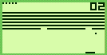

a "damaged" (DMG) CHIP8 emulator for the gameboy :)

To play, open up chip8.gb in your favorite emulator.

SELECT toggles between games (SHIFT key when using bgb)

The original Chip8 games are 64x32. That's tiny, so the
games are stretched horizontally, and then each vertical
line is drawn twice, to double the resolution to 128x64.

Through careful optimization, a full 60fps screen refresh
is achieved, without using double-speed mode (CGB). Each
game plays at slower than max-possible speed.
Tetris is the only game that plays full tilt, all other
games typically pause after drawing in some fashion, to
achieve reasonably fun gameplay. The flickering during
gameplay is a limitation (and arguably feature) of chip8.

Includes several classic Chip8 roms
pre-bundled. If you wish to add your own, please
open a pull request! You'll want to copy your .ch8
file next to all the others and call ROM_COPY
with your game name (without .ch8) at end

to compile the game, run `make` in your terminal.
(rgbasm should be installed locally or globally)
the assembled ROM will be called chip8.gb

----------------------------
Currently compatible with RGBDS v0.3.10 and lower
This is an old release, will not work with newer
versions of RGBDS! (pull requests to address this
are welcome as well)

Also check out [GB-8](https://github.com/Hacktix/GB-8),
another chip8 interpreter for the gameboy.
Sometime I'd like to compare notes :)
